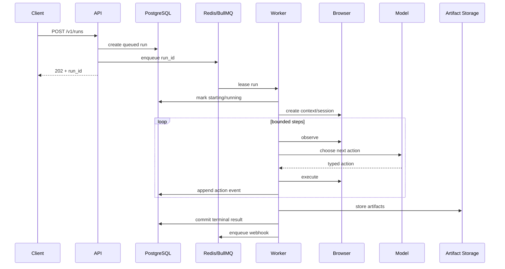
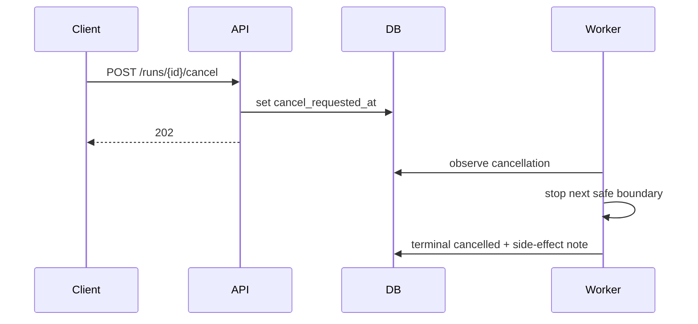

# Sequence diagrams

## Create and execute run

```mermaid
sequenceDiagram
  participant C as Client
  participant A as API
  participant D as PostgreSQL
  participant Q as Redis/BullMQ
  participant W as Worker
  participant B as Browser
  participant M as Model
  participant S as Artifact Storage

  C->>A: POST /v1/runs
  A->>D: create queued run
  A->>Q: enqueue run_id
  A-->>C: 202 + run_id
  Q->>W: lease run
  W->>D: mark starting/running
  W->>B: create context/session
  loop bounded steps
    W->>B: observe
    W->>M: choose next action
    M-->>W: typed action
    W->>B: execute
    W->>D: append action event
  end
  W->>S: store artifacts
  W->>D: commit terminal result
  W->>Q: enqueue webhook
```

## Cancellation

```mermaid
sequenceDiagram
  participant C as Client
  participant A as API
  participant D as DB
  participant W as Worker
  C->>A: POST /runs/{id}/cancel
  A->>D: set cancel_requested_at
  A-->>C: 202
  W->>D: observe cancellation
  W->>W: stop next safe boundary
  W->>D: terminal cancelled + side-effect note
```
